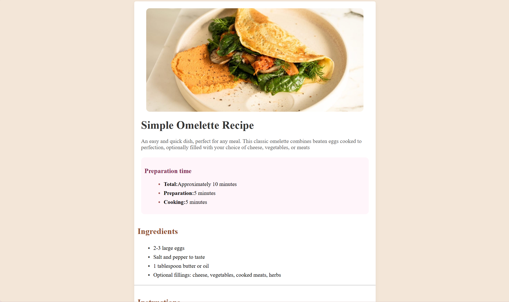

# Frontend Mentor - Recipe page solution

## Table of contents

- [Overview](#overview)
  - [Screenshot](#screenshot)
  - [Links](#links)
- [My process](#my-process)
  - [Built with](#built-with)
- [Author](#author)

## Overview

### Screenshot

### Links

- Solution URL: (https://github.com/Ilavoga/recipe-page.git)
- Live Site URL: (https://ilavoga-recipe-page.netlify.app/)

## My process

### Built with

- Semantic HTML5 markup
- CSS custom properties
- Flexbox
- CSS Grid

- Website - [Ilavoga](https://ilavoga-recipe-page.netlify.app/)
- Frontend Mentor - [@Ilavoga](https://www.frontendmentor.io/profile/Ilavoga)

